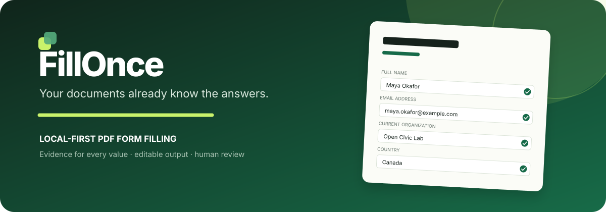
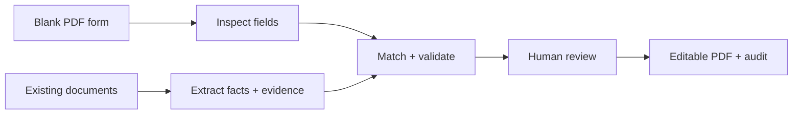

<div align="center">
  

  <p><strong>Local-first PDF form filling with evidence for every answer.</strong></p>

  <p>
    <a href="https://github.com/chivector/fillonce/actions/workflows/ci.yml"></a>
    <a href="LICENSE"></a>
    <a href="https://www.python.org/"></a>
    
  </p>
</div>

FillOnce takes a blank PDF form and documents that already contain your answers. It proposes field values, shows exactly where each answer came from, flags conflicts, and produces an editable filled PDF plus a standalone audit trail.

It follows two rules:

> **Never invent a fact. Never submit without you.**

## Why FillOnce?

Most form fillers automate typing. FillOnce automates the paperwork around the form:

- reuse facts from JSON, YAML, PDF, DOCX, Markdown, text, or CSV;
- match different labels such as “surname”, “family name”, and “姓”;
- stop when two documents disagree instead of silently picking one;
- keep native AcroForm fields editable;
- emit JSON and human-readable HTML evidence for every proposed value;
- run on your machine and delete web-session uploads immediately after each request.

The result is not a chatbot transcript. It is a PDF you can inspect, edit, sign, and submit yourself.

<div align="center">
  
  <p><sub>Generated from the fictional files in <a href="examples">examples/</a>. The PDF remains editable.</sub></p>
</div>

## 60-second demo

Requires Python 3.10+ and [uv](https://docs.astral.sh/uv/).

```bash
git clone https://github.com/chivector/fillonce.git
cd fillonce
uv sync --all-extras
uv run fillonce demo
```

Open these generated files:

```text
fillonce-demo/
├── blank-application.pdf
├── filled-application.pdf       # still natively editable
├── filled-application.audit.html
├── filled-application.audit.json
├── fill-plan.json               # review or edit before applying
└── sources/
```

Prefer a UI?

```bash
uv run fillonce serve
# open http://127.0.0.1:8765
```

No API key is required for the deterministic v0.1 pipeline.

### Optional grounded Agent matching

For unusual field labels, you can explicitly opt in to an OpenAI-compatible local or remote model:

```bash
uv run fillonce plan blank.pdf profile.json resume.docx \
  --agent-model qwen3 \
  --agent-base-url http://127.0.0.1:11434/v1
```

The model never gets permission to write a value. It can only return an existing `fact_id`, and every Agent suggestion is capped below the automatic-fill threshold and marked `review`. Remote endpoints receive field labels, extracted values, and evidence, so use them only if their privacy policy is appropriate for your documents.

## How it works



FillOnce uses a deliberately conservative matching engine. Exact semantic aliases can be filled automatically. Fuzzy matches require review. Missing and conflicting facts stay unresolved.

| Status | Meaning | Default behavior |
|---|---|---|
| `ready` | Exact, single-source semantic match | Filled |
| `review` | Plausible but uncertain match | Left blank |
| `missing` | No supported fact | Left blank |
| `conflict` | Sources contain different values | Left blank |

## CLI

Inspect a form without reading any source documents:

```bash
uv run fillonce inspect blank.pdf -o fields.json
```

Extract a reusable, auditable fact list:

```bash
uv run fillonce extract profile.json resume.docx transcript.pdf -o facts.json
```

Create a review plan without modifying the form:

```bash
uv run fillonce plan blank.pdf profile.json resume.docx -o fill-plan.json
```

Apply the plan after reviewing or editing it:

```bash
uv run fillonce apply fill-plan.json -o completed.pdf
```

Or run the safe fields end to end:

```bash
uv run fillonce fill blank.pdf profile.json resume.docx -o completed.pdf
```

## Python API

```python
from fillonce import apply_plan, build_plan

plan = build_plan(
    "blank-application.pdf",
    ["profile.json", "resume.docx", "transcript.pdf"],
)

for item in plan.fields:
    print(item.field.label, item.value, item.status, item.source)

apply_plan(plan, "completed.pdf")
```

## Current support

FillOnce is an early, working release. Its boundaries are explicit.

| Capability | v0.1 |
|---|---|
| Native AcroForm text fields | ✅ |
| Checkboxes | ✅ |
| Choice field inspection | ✅ |
| Editable output | ✅ |
| JSON/YAML structured sources | ✅ |
| PDF/DOCX/text extraction | ✅ |
| Per-field provenance | ✅ |
| Conflict detection | ✅ |
| Local review UI | ✅ |
| Scanned/flat PDF auto-layout | Planned |
| Handwriting OCR | Planned |
| Browser form filling | Planned |
| Signatures or automatic submission | Intentionally excluded |

See [ROADMAP.md](ROADMAP.md) for the order of work and [docs/architecture.md](docs/architecture.md) for design decisions.

## Privacy and safety

Paperwork often contains identity, financial, education, and health information. FillOnce therefore defaults to:

- no account, telemetry, analytics, or remote storage;
- no network calls in the core pipeline;
- temporary web uploads deleted after the request;
- no automatic form submission;
- no filling of unresolved fields;
- evidence attached to every proposed answer.

Do not treat FillOnce as legal, immigration, tax, medical, or financial advice. You are responsible for reviewing the completed form and complying with the form issuer's rules. Read the full [privacy model](PRIVACY.md) and [security policy](SECURITY.md).

## Project principles

1. **Source-bound answers.** A value must come from a supplied source or explicit human confirmation.
2. **Review before action.** Filling and submitting are separate operations.
3. **Native deliverables.** Preserve real PDF fields instead of painting a screenshot when possible.
4. **Deterministic first.** AI may resolve ambiguity later; it may never create a new fact.
5. **Portable evidence.** Audits are plain JSON and HTML, not records trapped in a hosted dashboard.

## Contributing

The fastest ways to help are adding anonymized test forms, aliases, extractors, and rendering tests. Please read [CONTRIBUTING.md](CONTRIBUTING.md) before opening a pull request.

If a test form originally contained personal information, do not submit it—even if you believe the visible text has been removed. Create a synthetic equivalent instead.

## License

[MIT](LICENSE) © 2026 Chi Zhang and FillOnce contributors.
